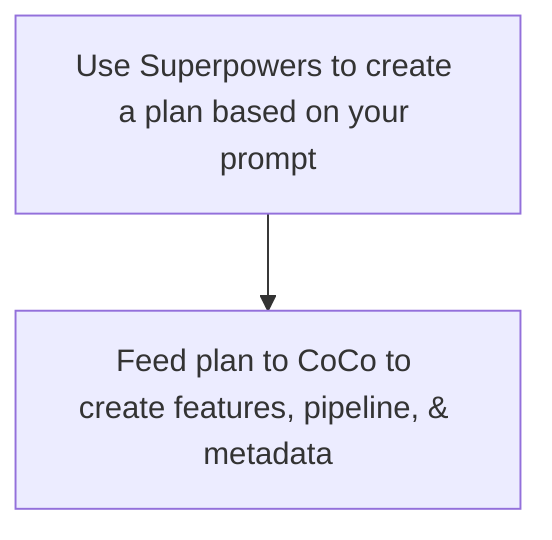
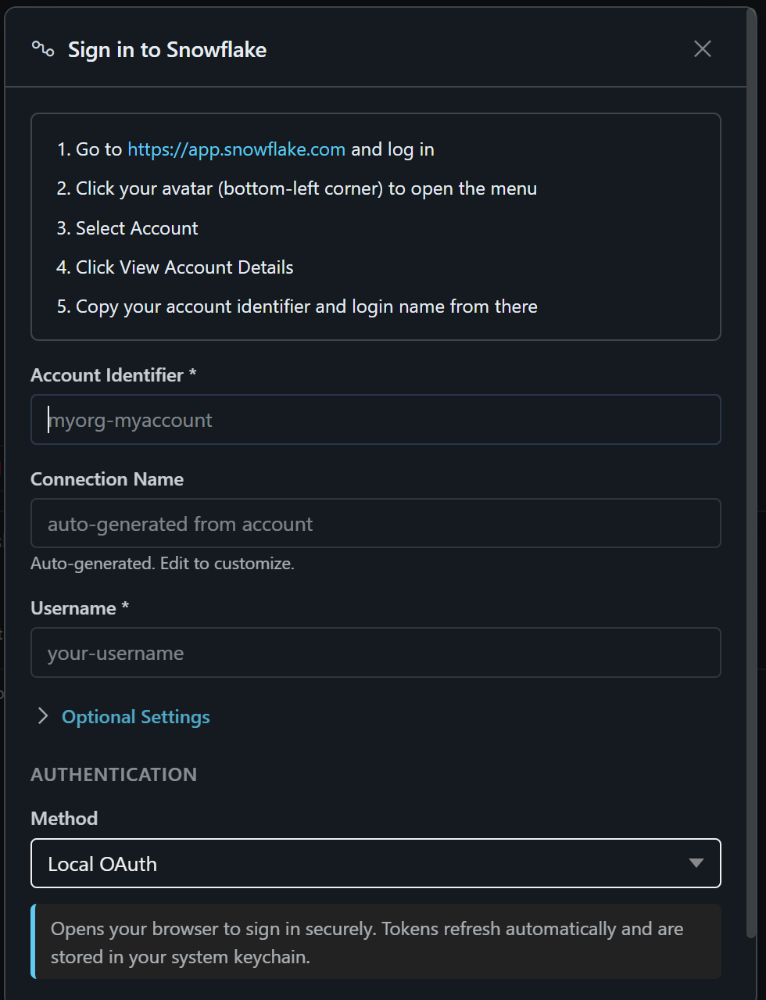
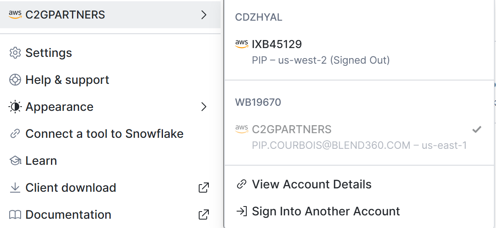
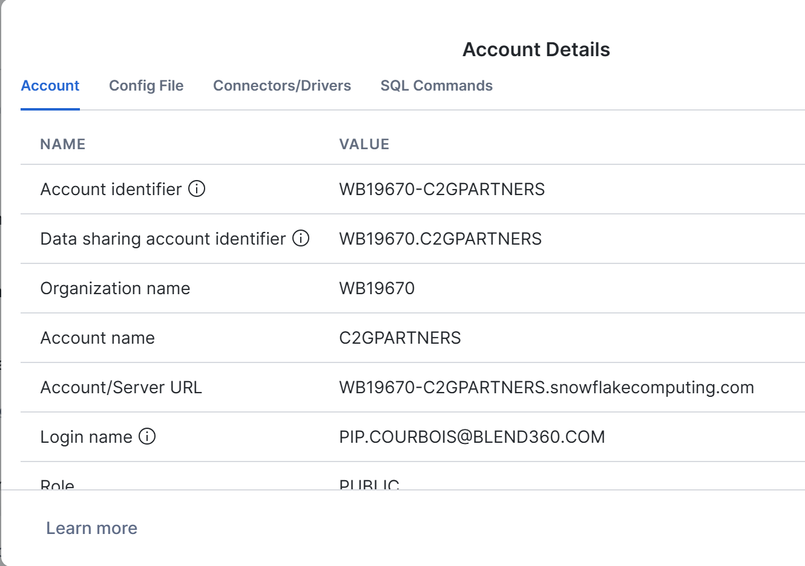
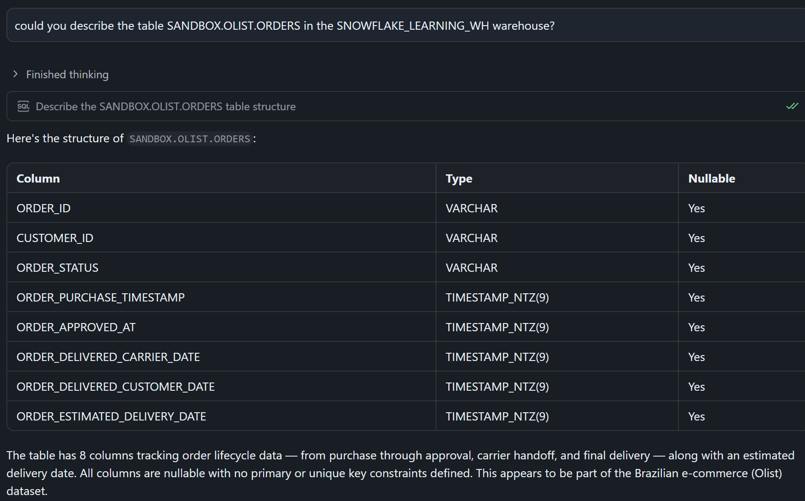

# AI-Assisted Feature Engineering Pipeline Demo — Prep Instructions

**Demo Type:** Online video call with live walkthrough + AI markdown generation + code review  
**Duration:** 60 minutes  
**Audience:** Mixed technical profiles  

---

## Overview

During this session you'll participate in a live demonstration of how AI, based on your prompts, generates a production-ready data pipeline for feature engineering in Snowflake. The use case will be for marketing analytics/ Customer Lifetime value in a retail situation. 

The work flow will be 



**What you'll need:**


- A Snowflake account with access to the demo datasets. Instructions below.
- Github account - Instructions below
- [Snowflake CoCo desktop](https://www.snowflake.com/en/product/snowflake-coco/) (Cortex Code) - Instructions below
- [Claude API access](https://code.claude.com/docs/en/overview)
- [Claude Superpowers plugin](https://claude.com/plugins/superpowers)


---

## Setting up Snowflake

You must have your own **Snowflake account** with access to the **SANDBOX** database and **OLIST** schema.

### Accessing Snowflake

1. Go to: **https://app.snowflake.com**
2. Log in with the company credentials
3. Once logged in, look for the database: **`SANDBOX`**
4. Within SANDBOX, navigate to the schema: **`OLIST`**
5. You should see multiple tables in the OLIST schema (all will be used for the demo)
6. test:

```SQL 
USE WAREHOUSE SNOWFLAKE_LEARNING_WH; 
select * from SANDBOX.OLIST.ORDERS limit 100;
```

**If you don't see the database or schema:**
Check your role/permissions (ask your Snowflake admin)

---
## Setting up CoCo
Once you launch CoCo, you will see this screen. Follow the instructions (it's easy)


When you click on your avitar, click on account:


And then click on "View Account Details"



Copy information from there.

Test:


---

## Github Repo Instructions

You will fork repo: https://github.com/pip-blend360/AI-Assisted-Feature-Engineering-Demo.git. 

### Branches

There are four branches in the repo, choose the branch that you would like to try:

1. 🪹 `main` - no instructions file, make your own! 
2. 🎯`Aaron` - This approach generates a generic, data-agnostic, markdown that can be used with any given dataset and then feed into Snowflake Coco with few extra documentation.
3. 🫧 `David` -
4. 🌱 `Pip` - Minimilist approach, give as few instructions as possible. Make Superpowers do the work.

### Forking options
You can choose one of the following options. 

1. Fork the repository and push your work to your own GitHub account (preferred), or

```
git clone https://github.com/YOUR-USERNAME/REPOSITORY-NAME.git
cd REPOSITORY-NAME
git remote add upstream https://github.com/ORIGINAL-OWNER/REPOSITORY-NAME.git
git checkout -b my-work
git add .
git commit -m "My changes"
git push origin my-work
```

2. Create a new branch in my repository and push your work there.

```
git checkout -b my-new-branch
git add .
git commit -m "My changes"
git push -u origin my-new-branch
```

Please do not push directly to the main branch of my repository (you cannot anyway).


